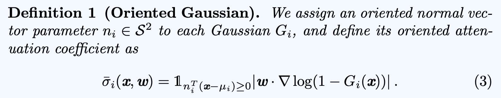

# Next-Gen Photogrammetry
## Pipeline Steps
1. **Given an unordered image collection, bootstrap poses + 3DGS with [i3dgs](https://github.com/graphdeco-inria/i3dgs/)**
* Robust hierarchical matching
* Loop closure
* GPU-accelerated bundle adjustment
* Live preview
    * When user wants immediate feedback on reconstruction progress
2. **Extract mesh from 3DGS with [Gaussian Wrapping](https://github.com/diego1401/GaussianWrapping)** (TODO)
> Only adds 2 learnable parameters to vanilla 3DGS: 

## Experimental Results
* Tanks and Temples - Train - T4 GPU
    * num keyframes: 223, time: 299.286, FPS: 1.006, Gaussians: 749385
    * Note: Due to being GPU poor in Google Colab, I had to pass `--downsampling 2.5` to `train.py`
    * <video controls src="flythrough_h264.mp4" title="i3DGS"></video>

## Running the Notebook
* Replace `SOURCE_PATH = Path("/kaggle/input/CHANGE-ME")` with your data. Your images must be placed under a folder named `images`.